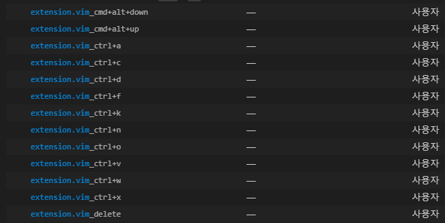

# VSCode extensions

## common

- VSCodeVim
  - VSCode에서 쓰고있는 단축키와 중복되는 단축키 Keyboard Shortcuts에서 검색하여 Remove Keybinding
  - 
  - enable easymotion(사용법:\\\\w)
- TabOut
- Material Theme

## for Markdown

- markdownlint

## for Web dev

- JS-CSS-HTML Formatter
- IntelliSense for CSS class names in HTML
- ESLint
- open in browser(alt+b 누르면 브라우저에서 열린다)

## for FTP
- ftp-sync
